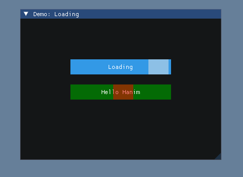
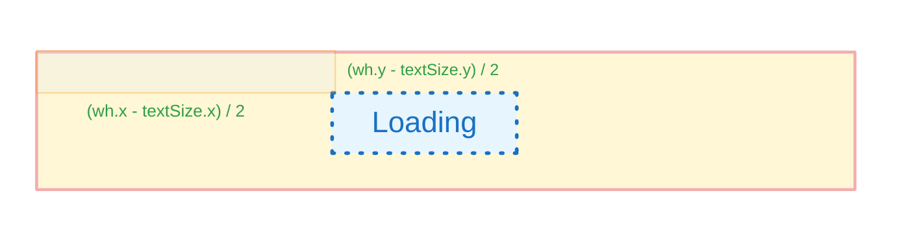

# Loading动画控件

## 基本介绍

### 控件效果

一个滑动块来回运动的加载动画控件

<figure><figcaption></figcaption></figure>

### 控件接口

```cpp
static void Loading(
    const char *text, HVec2 pos, HVec2 wh,
    unsigned int frameNums = 120,
    ImVec4 color = ImVec4(0.9, 0.9, 0.9, 0.5),
    ImVec4 background = ImVec4(0.2, 0.6, 0.9, 1)
)
```

* text: 控件文本
* pos: 控件(左上角)位置
* wh: 控件的宽和高
* frameNums: 控件滑动块移动动画单趟的帧数
* color: 滑动块的颜色
* background: 控件的底色/背景色

## 控件元素与动画

### 基本元素

* 一个**矩形**背景
* 一个**文本**&#x20;
* 一个与背景等高的**滑动块**

### 动画

* 往返运动 的**位移动画**

## 设计与实现

### 基本元素

#### 矩形背景

```cpp
// Canvas()指向当前窗口区域
// draw bg
Canvas().addRectFilled(pos, pos + wh, ImColor(background));
```

使用pos作为左上顶点, pos + wh 作为右下顶点, background做为填充色绘制背景矩形

#### 文本

```cpp
// draw text
ImVec2 textSize = ImGui::CalcTextSize(text);
auto textPos = pos + HVec2{(wh.x - textSize.x) / 2, (wh.y - textSize.y) / 2};
ImGui::SetCursorPosX(textPos.x);
ImGui::SetCursorPosY(textPos.y);
ImGui::Text(text);
```

使用`ImGui::CalcTextSize`获取文本的大小(包围盒的W和H), 用控件(背景矩形)的`wh`计算出文本的相对坐标, 再加上控件坐标`pos`, 得到最终的文本坐标`textPos`

<figure><figcaption></figcaption></figure>

获取文本坐标后, 使用`ImGui::SetCursorPosX 和 ImGui::SetCursorPosY` 设置文本控件坐标, 再使用`ImGui::Text`进行显示(绘制)

#### **滑动块**

<pre class="language-cpp"><code class="lang-cpp">float blockWidth = wh.x * 0.2;
<strong>//....
</strong><strong>Canvas().addRectFilled(pos, pos + HVec2{blockWidth, wh.y}, ImColor(color));
</strong></code></pre>

它和背景一样使用`addRectFilled`绘制一个与背景矩形等高,且宽度为0.2倍(`blockWidth`)的小的填充矩形, 但是这里滑动块的`pos`需要动态更新, 下面将介绍动态更新方法。

### **位移动画与滑动块**

```cpp
auto anim = HEngine::AManager::registerAnimate<hanim::Move>(
    pos, pos + HVec2{wh.x - blockWidth, 0},
    HAnimate::Config {
        .playType = hanim::HAnimate::PlayType::RT,
        .frameNums = frameNums
    }
);
```

使用`HEngine::AManager::registerAnimate`注册一个移动动画, 从`pos` 到 `pos + HVec2{wh.x - blockWidth, 0}`; 高度保持不变, 水平移动`距离为控件的宽减去滑动块的宽度。`

<figure><figcaption></figcaption></figure>

同时把动画的播放类型配置为`PlayType::RT`,实现目标对象的往返运动

```cpp
if (auto animPtr = anim.lock()) {
    HEngine::PlayFrame(
        *animPtr,
        [ & ](int type, const hanim::IAFrame &frame) {
            auto pos = HVec2{frame.data[0], frame.data[1]};
            Canvas().addRectFilled(pos, pos + HVec2{blockWidth, wh.y}, ImColor(color));
        }
    );
}
```

这里使用`HEngine::PlayFrame`把动画和滑动块进行结合, 生成按帧播放的动画

其中, `*animPtr` 为前面创建的**移动动画**, `[ & ](int type, const hanim::IAFrame &frame) {...}` 为具体要**渲染的对象**, 根据每一帧到lambda表达式的插值动画数据实现动态的更新滑动块的坐标, 进而形成滑动块往返运动的效果

综合上面的代码, 就可以得到一个简单**动画控件Loading**的实现了

## 核心接口(API)列表

### Hanim

<table><thead><tr><th width="461">接口</th><th>简述</th></tr></thead><tbody><tr><td><pre class="language-cpp"><code class="lang-cpp">Canvas()
</code></pre></td><td>对ImGui的drawList的封装, 简化当前窗口绘制区域的步骤</td></tr><tr><td><pre class="language-cpp"><code class="lang-cpp">HEngine::AManager::registerAnimate
</code></pre></td><td>用于进行注册并创建动画, 返回对应动画的指针(std::weak_ptr)</td></tr><tr><td><pre><code>hanim::Move(pos1, pos2, config)
</code></pre></td><td>创建位移动画的接口/对象</td></tr><tr><td><pre><code>HAnimate::Config
</code></pre></td><td>动画基础属性配置类型</td></tr><tr><td><pre><code>HEngine::PlayFrame(animate, hobj)
</code></pre></td><td>把anim动画作用到hobj对象上, 可以使用了lambda表达式做为临时对象</td></tr><tr><td><pre><code>std::function&#x3C;void (int, const IAFrame &#x26;)>
</code></pre></td><td>插值动画lambda表达式的签名要求类型</td></tr></tbody></table>

### ImGui

<table><thead><tr><th width="469">接口</th><th>简述</th></tr></thead><tbody><tr><td><pre class="language-cpp"><code class="lang-cpp">DrawList->AddRectFilled(...)
</code></pre></td><td>绘制带填充色的矩形</td></tr><tr><td><pre class="language-cpp"><code class="lang-cpp">ImGui::CalcTextSize(text)
</code></pre></td><td>计算文本的大小</td></tr><tr><td><p></p><pre class="language-cpp"><code class="lang-cpp">ImGui::SetCursorPosX(.) / ImGui::SetCursorPosY(.)
</code></pre></td><td>设置下一个控件的坐标(当前窗口坐标视为(0,0))</td></tr><tr><td><pre class="language-cpp"><code class="lang-cpp">ImGui::Text(text)
</code></pre></td><td>绘制文本</td></tr></tbody></table>






